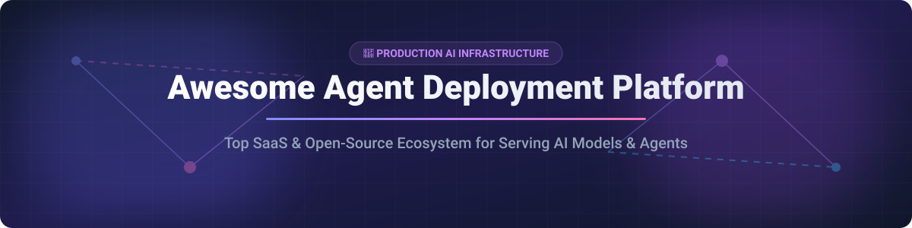

  

# 🚀 Awesome Agent Deployment Platform Ecosystem 🤖

  
  
  
  

---

## 💡 Overview & Market Insights 📊

Welcome to the **Awesome Agent Deployment Platform** repository! A curated list of production-grade **SaaS platforms**, **serverless GPU providers**, and **open-source model serving frameworks** designed for hosting, scaling, and deploying Large Language Models (LLMs), AI agents, and Machine Learning workflows.

### 📈 Market Size & Industry Dynamics
* **Estimated Market Size**: The global AI Infrastructure & Agent Deployment Platform market is estimated at **$18.5 Billion (2026)** and is projected to expand at a CAGR of **~34.2%**, reaching over **$75 Billion by 2030**.
* **Market Fragmentation**: The market is currently **moderately fragmented**. While cloud hyperscalers provide foundational compute, specialized serverless GPU providers (e.g., Baseten, Modal) and open-source engines (e.g., vLLM, Ollama) lead developer adoption in high-efficiency LLM serving and autonomous agent hosting.

---

## 📑 Table of Contents 📌

- [☁️ SaaS / Hosted Platforms](#-saas--hosted-platforms)
- [🔓 Open-Source GitHub Projects](#-open-source-github-projects)
- [🛠️ How to Contribute](#️-how-to-contribute)
- [📈 Star History](#-star-history)
- [💖 Support & Sponsorship](#-support--sponsorship)
- [⚠️ Disclaimer](#%EF%B8%8F-disclaimer)

---

## ☁️ SaaS / Hosted Platforms 🌐

> [!NOTE]
> Below is a comparison of top managed AI deployment platforms, sorted by **Company Valuation / Market Size** (Descending).

| Platform 🚀 | Description 📝 | Starting Paid Tier 💰 | Free Tier / Trial Limit 🎁 | Company Valuation / Revenue 💎 |
| :--- | :--- | :--- | :--- | :--- |
| **[Baseten](https://www.baseten.co/)** | High-performance inference platform for deploying custom & open-source models at scale with optimized runtimes. | Basic Pay-as-you-go ($0.0003/sec GPU compute) | Free trial credits granted upon sign-up ($2,500+ for startups) | **$13.0 Billion** ($600M ARR) |
| **[Modal](https://modal.com/)** | Serverless cloud platform optimized for AI/ML—run GPU inference, training, and agent workloads with pythonic code. | Starter ($0/mo + usage-based compute) | **$30 free compute credits** every month | **$4.65 Billion** ($300M ARR) |
| **[Anyscale](https://www.anyscale.com/)** | Managed Ray platform for scaling Python, distributed AI agent pipelines, and high-concurrency model serving. | Hosted Pay-as-you-go (per instance-hour) | **$100 in free trial compute credits** | **$1.65 Billion** ($100M ARR) |
| **[RunPod](https://www.runpod.io/)** | Scalable GPU cloud platform & serverless inference for hosting custom LLMs and autonomous agent backends. | Serverless Pay-as-you-go ($0.0002/sec GPU) | No permanent free plan ($1,000 startup credit grants available) | **$1.0 Billion** ($120M ARR) |
| **[Replicate](https://replicate.com/)** | API-first platform running community and custom open-source models with minimal infrastructure overhead. | Pay-per-use ($0.000225/sec on T4 GPU) | Limited free trial credits on sign-up | **$350 Million** (Acquired by Cloudflare) |
| **[TrueFoundry](https://www.truefoundry.com/)** | Enterprise MLOps and AI Gateway platform for deploying models and multi-agent systems on private cloud / VPC. | Pro Tier starting at **$499/month** | **Developer Free Plan** (Up to 3 users & 50,000 monthly API requests) | **$21.3M Raised** (~$10M ARR) |

---

## 🔓 Open-Source GitHub Projects ⚡

> [!TIP]
> Production-ready open-source engines and frameworks for hosting LLMs, serving multi-agent graphs, and local model inference. Sorted by **GitHub Star Count** (Descending).

| Repository 📦 | Description 🎯 | GitHub Stars ⭐ |
| :--- | :--- | :--- |
| **[Ollama](https://github.com/ollama/ollama)** | Get up and running with Llama 3, Mistral, Gemma, and other large language models locally and on private servers. |  |
| **[llama.cpp](https://github.com/ggml-org/llama.cpp)** | LLM inference in C/C++ with minimal setup, hardware acceleration, and quantization support. |  |
| **[vLLM](https://github.com/vllm-project/vllm)** | High-throughput, memory-efficient open-source LLM serving engine with PagedAttention and continuous batching. |  |
| **[LocalAI](https://github.com/mudler/LocalAI)** | Open-source OpenAI-compatible REST API for local AI inference without GPU requirement. |  |
| **[Ray](https://github.com/ray-project/ray)** | Unified framework for scaling AI and Python applications, featuring Ray Serve for scalable multi-agent deployment. |  |
| **[BentoML](https://github.com/bentoml/BentoML)** | Build, test, and deploy production-grade AI applications and model services on any cloud infrastructure. |  |
| **[Text Generation Inference](https://github.com/huggingface/text-generation-inference)** | Hugging Face's production-oriented server for deploying LLMs with optimized inference runtimes. |  |
| **[KServe](https://github.com/kserve/kserve)** | Kubernetes-native model serving platform supporting autoscaling, multi-model runtimes, and enterprise MLOps. |  |
| **[Triton Inference Server](https://github.com/triton-inference-server/server)** | NVIDIA's multi-framework open-source inference server for high-performance CPU & GPU model deployment. |  |
| **[Seldon Core](https://github.com/SeldonIO/seldon-core)** | Cloud-native MLOps framework for deploying, auditing, and managing thousands of machine learning models on Kubernetes. |  |

---

## 🛠️ How to Contribute 🤝

Contributions are very welcome! If you know of an awesome AI deployment platform or open-source serving engine:

1. Fork this repository. 🍴
2. Add your entry to either the **SaaS / Hosted Platforms** or **Open-Source GitHub Projects** table in `README.md`.
3. Ensure all fields (pricing, free limits, valuation, star badges, stargazers link) follow the established format.
4. Open a Pull Request 📥 with a short description of the platform.

---

## 📈 Star History 🌟

---

## 💖 Support & Sponsorship ☕

If you find this curated ecosystem list helpful for your AI architecture, team, or projects, please consider supporting the maintenance of this repository!

* 🌟 **Star** this repository to show your appreciation.
* 🔀 **Fork** and share it with fellow AI engineers and MLOps practitioners.
* ☕ **Buy me a coffee**: Support ongoing open-source research via the [GitHub Sponsors Dashboard](https://github.com/sponsors/ishandutta2007).

---

## ⚠️ Disclaimer 📜

- This repository is a community-curated collection intended for informational and educational purposes.
- Valuations, pricing plans, and free tier limits are subject to change by respective platform providers.
- When deploying production AI applications, always ensure proper authentication, rate limiting, and security compliance.
